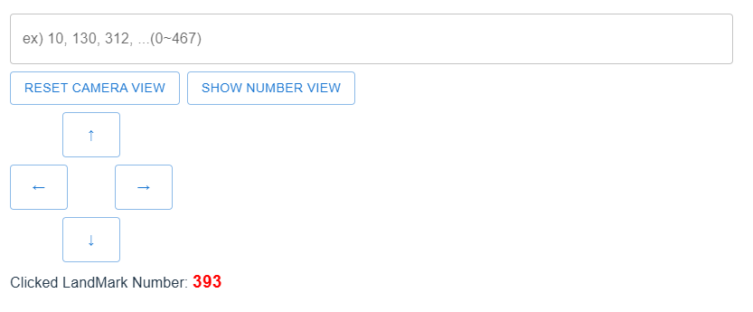
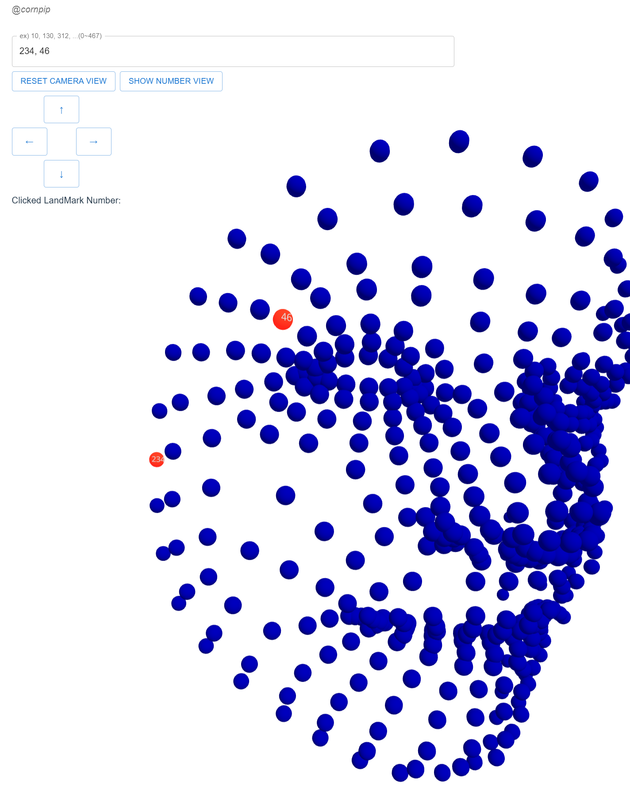
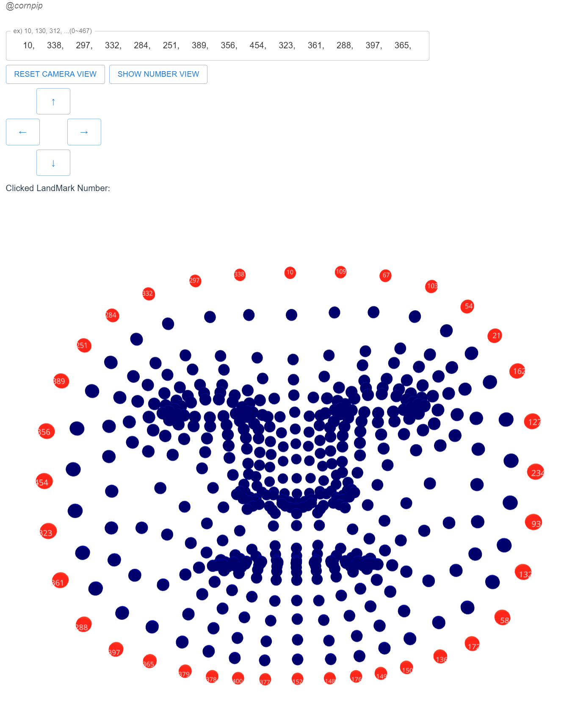
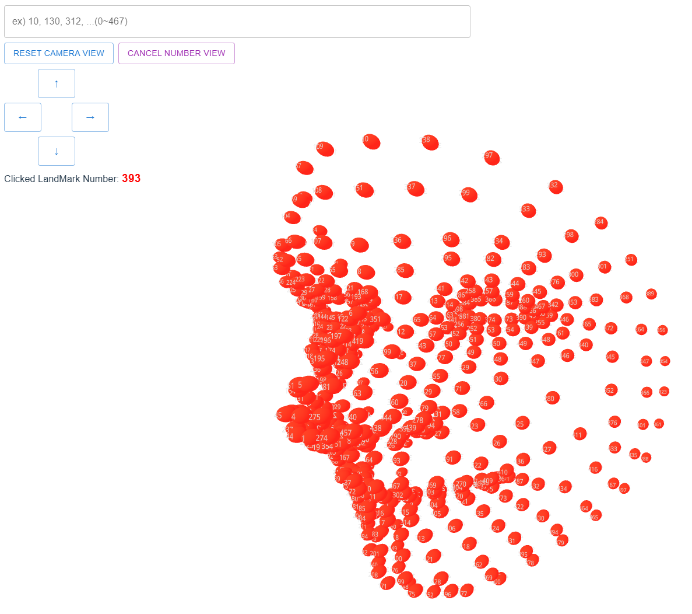

# Mediapipe Landmark 3D Viewer(Face)

### **[Mediapipe Landmark 3D Viewer Link](https://cornpip.github.io/mediapipe_landmark_viewer/)**

Face Mesh (468 points)  
각 랜드마크에 번호를 표시하여, 어떤 점이 얼굴의 어떤 부위에 해당하는지 바로 확인할 수 있습니다.

The viewer renders each landmark with its index number, so you can instantly see which point corresponds to which facial featur

## Usage Guide

0 ~ 467 까지 포인트가 있습니다.  
키보드로 View를 수평이동 할 수 있습니다.  
포인트 클릭시 해당 랜드마크 번호를 확인할 수 있습니다.

There are points from 0 to 467.  
You can pan the view horizontally using the keyboard.  
Click a point to see its number.

## Example Image

## Reference

The landmark data used comes from the following JSON source: [link](https://github.com/lschmelzeisen/understanding-mediapipe-facemesh-output/blob/main/output/landmarks.json)

Landmark numbers on a face image: [link](https://storage.googleapis.com/mediapipe-assets/documentation/mediapipe_face_landmark_fullsize.png)

## License

This project is licensed under the MIT License. See the [LICENSE](LICENSE) file for details. Copyright (c) 2024 cornpip.
