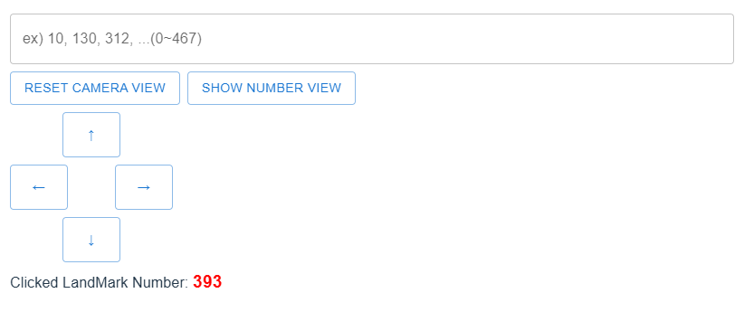
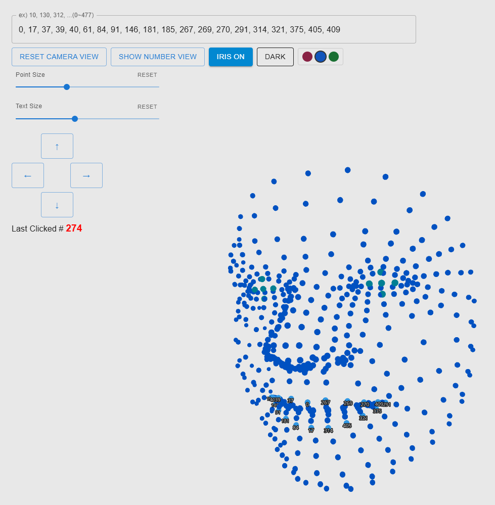

# MediaPipe Landmark 3D Viewer (Face)

### **[MediaPipe Landmark 3D Viewer Link](https://cornpip.github.io/mediapipe_landmark_viewer/)**

Interactive 3D viewer for MediaPipe Face Mesh landmarks.
Renders each landmark with its index number so you can instantly see which point corresponds to which facial feature.

- **Face landmarks**: 0 – 467 (468 points)
- **Iris landmarks**: 468 – 477 (10 points, toggle on/off)

## Usage Guide

- Enter comma-separated indices to highlight specific landmarks (e.g. `10, 130, 312`).
- Click any point to see its landmark number.
- Pan the view horizontally with the arrow keys or the on-screen buttons.
- **show number view** — labels every visible landmark with its index.
- **iris ON / OFF** — toggles the iris landmarks (468–477, shown in cyan).
- **Dark / Light** — toggles the color theme.

## Example

## Reference

Landmark data source: [link](https://github.com/lschmelzeisen/understanding-mediapipe-facemesh-output/blob/main/output/landmarks.json)

Iris landmark positions derived from the MediaPipe canonical face model with iris:
[face_model_with_iris.obj](https://github.com/google-ai-edge/mediapipe/blob/master/mediapipe/modules/face_geometry/data/face_model_with_iris.obj)

Landmark index map: [link](https://storage.googleapis.com/mediapipe-assets/documentation/mediapipe_face_landmark_fullsize.png)

## License

MIT License. Copyright (c) 2026 cornpip. See [LICENSE](LICENSE) for details.
